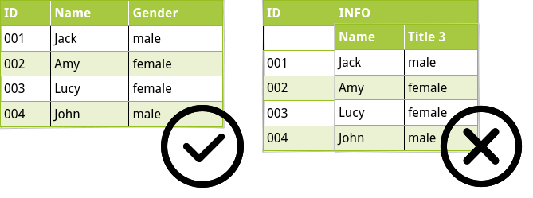
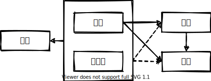

&emsp;&emsp;为了设计出一个好的关系型数据库模式，需要按照规范化（Normalization）方法对关系模式进行优化。满足不同程度要求的规范化被称作范式。下面将在函数依赖的范畴内，依次讨论1NF、2NF、3NF与BCNF。

<!-- more -->

### 1NF

&emsp;&emsp;1NF要求每一个分量必须是不可分的数据项。简而言之就是不能表中有表：

> 

&emsp;&emsp;这是最基本的规范化，满足1NF的数据库模式依然可能存在插入异常、删除异常、冗余过大的问题。

### 2NF

&emsp;&emsp;在满足1NF的基础上，每一个非主属性（Non-prime attribute）「即不出现在任何码中的属性」**完全函数依赖**于码（Key），则满足2NF。

#### 函数依赖

##### 完全函数依赖

&emsp;&emsp;对于函数依赖X->Y，有任意X的真子集X'，满足Y不函数依赖于X'，则X->Y称为完全函数依赖。

##### 部分函数依赖

&emsp;&emsp;不是完全函数依赖的就是部分函数依赖。

&emsp;&emsp;对于不满足2NF的关系模式，解决问题的方法是用投影将原关系模式为两个关系模式。

> &emsp;&emsp;学生-地址-选课关系(学号，系所，地址，课程号，成绩)
>
> &emsp;&emsp;在这个关系中（学号，课程号）是码。学号唯一确定院系与住址，院系唯一确定住址，学号与课程号唯一确定成绩。在这个关系中存在非主属性部分函数依赖于码，如住址部分依赖于（学号，课程号）。
>
> 
>
> &emsp;&emsp;分解为两个关系
>
> &emsp;&emsp;学生-课程关系（学号，课程号，成绩），码是（学号，课程号）。
>
> &emsp;&emsp;学生-地址关系（学号，系所，住址），码是学号。
>
> 
>
> &emsp;&emsp;这样每一个关系内都不存在部分函数依赖于码的情况了。
>

### 3NF

&emsp;&emsp;消除非主属性对码的传递函数依赖。即每一个非主属性既不部分依赖于码也不传递依赖于码。

&emsp;&emsp;X->Y, Y->Z, 但X不函数依赖于Y（如果有Y->X，则是X直接决定Z），则Z传递依赖于X。存在这样关系的关系模式则不符合3NF。

&emsp;&emsp;解决的方法是将关系模式分解。

> &emsp;&emsp;刚才分解后的学生-地址关系中包含非主属性对码的传递依赖。
>
> 
>
> &emsp;&emsp;可以看到学号->系所（但没有系所->学号），系所->地址。因此按照传递依赖的定义，地址传递依赖于学号。（虽然有学号->地址但是和我们这里的传递依赖没关系）
>
> &emsp;&emsp;由于地址是非主属性，因此这是不满足3NF的定义的，需要进行分解。
>
> 
>
> &emsp;&emsp;学号-系所关系（学号，系所），码是学号。
>
> &emsp;&emsp;系所-地址关系（系所，地址），码是系所。
>
> &emsp;&emsp;分解后不存在非主属性对码的传递依赖，满足3NF

### BCNF

&emsp;&emsp;要使一个关系模式满足BCNF，则至少要满足以下条件：

> 1. 所有非主属性对每一个码都是完全函数依赖。
>
> 2. 所有主属性对每一个不包含它的码也是完全函数依赖。
>
> 3. 没有任何属性完全函数依赖于非码的任何一组属性。

&emsp;&emsp;其实比3NF就多了主属性对码也不能有部分或传递函数依赖。

> &emsp;&emsp;比分说下面这个例子
>
> &emsp;&emsp;学生-教师-课程关系（学生，教师，课程）中，教师只教一门课，每门课对应多名教师。学生选定某门课就对应一名教师。
>
> &emsp;&emsp;码有两个（学生，课程），（学生，教师）
>
> 
>
> &emsp;&emsp;这里所有属性都是主属性，不存在非主属性，因此满足3NF。
>
> &emsp;&emsp;但对于课程来说，教师直接决定课程。因此主属性课程对（学生，教师）部分函数依赖，不符合BCNF定义。
>
> &emsp;&emsp;优化的方法依然是分解。
>
> 
>
> &emsp;&emsp;学生-教师关系（学生，教师），码是学生。
>
> &emsp;&emsp;教师-课程关系（教师，课程），码是教师。
>
> &emsp;&emsp;这样就满足BCNF了。

### 总结

规范化过程：

&emsp;&emsp;至此，关于函数依赖相关的范式介绍完毕，但尽管是满足BCNF的关系模式依然有所不足，这时就需要要求4NF进行约束。「关于4NF的讨论见[数据库基础-多值依赖与4NF](/TODO)」

